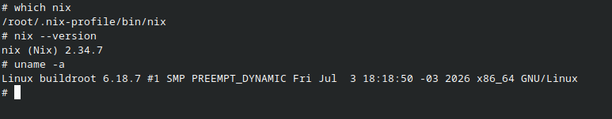
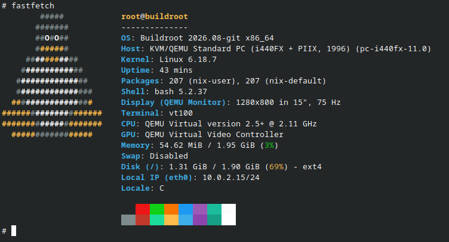

# buildroot-nix
A minimal Linux system built with Buildroot, extended using the Nix package manager.




Buildroot as a minimal base.
Nix as the powerful package manager.


The goal of this project is to combine the lightness and versatility of Buildroot with the robustness and flexibility of Nix for package management.

---

## Features

- Buildroot 2026.08-git
- Linux Kernel 6.18.7
- Bash
- Dropbear SSH
- GNU Coreutils
- Curl
- Nix Package Manager
- Fastfetch

---

## Project Philosophy

Instead of rebuilding the entire operating system every time you want a new package, this project keeps Buildroot as a minimal base system and uses Nix to install software on top of it.

This provides:

- Minimal base system
- Easy package management
- Reproducible Buildroot configuration
- Keeping the lightness of Buildroot

---

## Repository Structure

```
buildroot-nix/
├── configs/
│   └── buildroot-nix_defconfig
├── scripts/
│   ├── install-nix.sh
│   └── install-packages.sh
│   └── start-qemu.sh
│
├── docs/
├── screenshots/
├── README.md
└── LICENSE
```

---

## Requirements

Host:

- Linux
- Git
- QEMU
- Buildroot

Guest:

- Buildroot Linux

---

## Building

Clone Buildroot:

```bash
git clone https://github.com/buildroot/buildroot.git
cd buildroot
```

Copy the provided defconfig:

```bash
cp /path/to/buildroot-nix_defconfig configs/
```

Configure Buildroot:

```bash
make buildroot-nix_defconfig
```

Compile:

```bash
make (you can use -j# if you want)
```

---

## Running

Start the virtual machine:

```bash
./scripts/start-qemu.sh
```

---

## Installing Nix

Enter the virtual machine:

```bash
./install-nix.sh
```

---

## Installing Packages

Example:

```bash
nix-env -iA nixpkgs.fastfetch
```

---

## Screenshots

(Add screenshots here.)

---

## License

This repository is licensed under the MIT License.

Buildroot itself is distributed under its own license.
